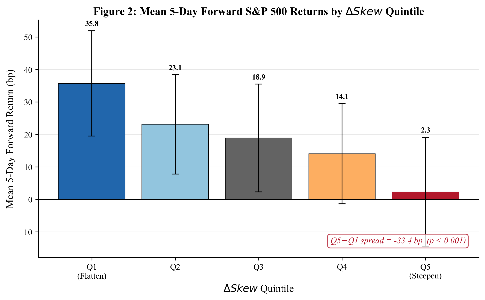
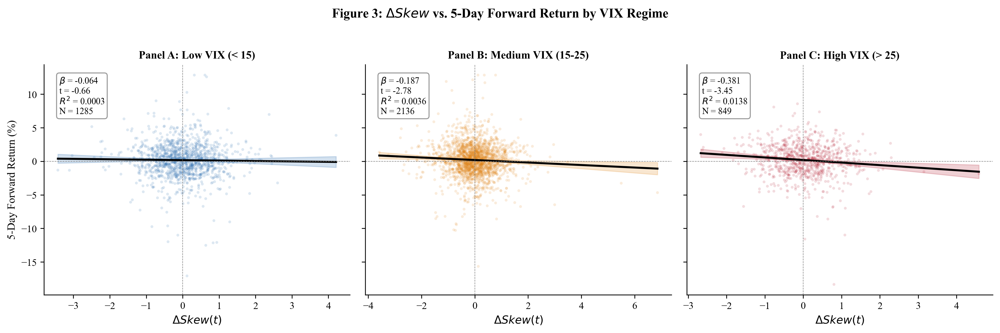
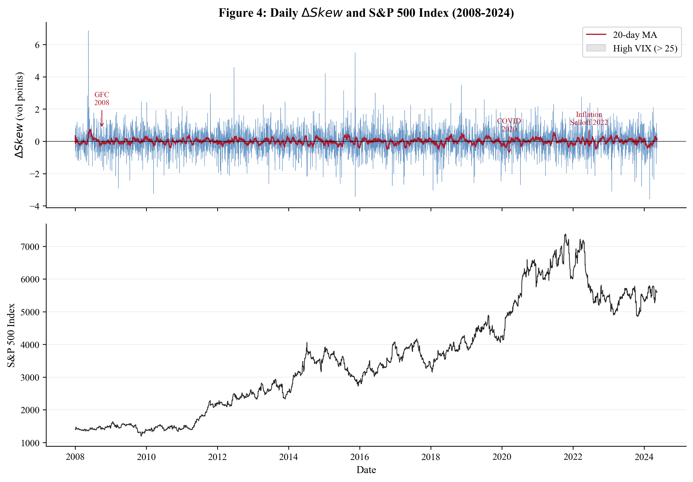
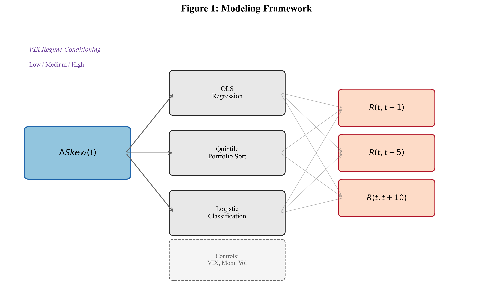
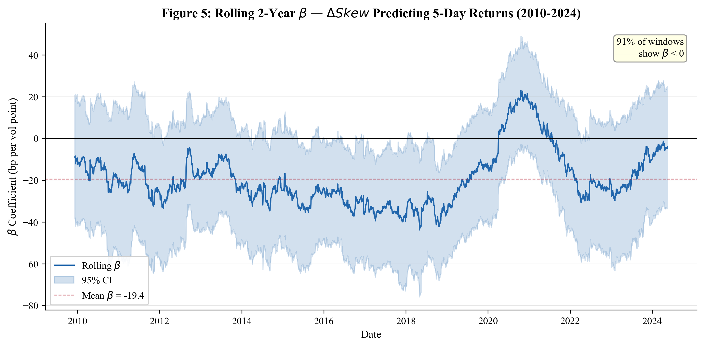
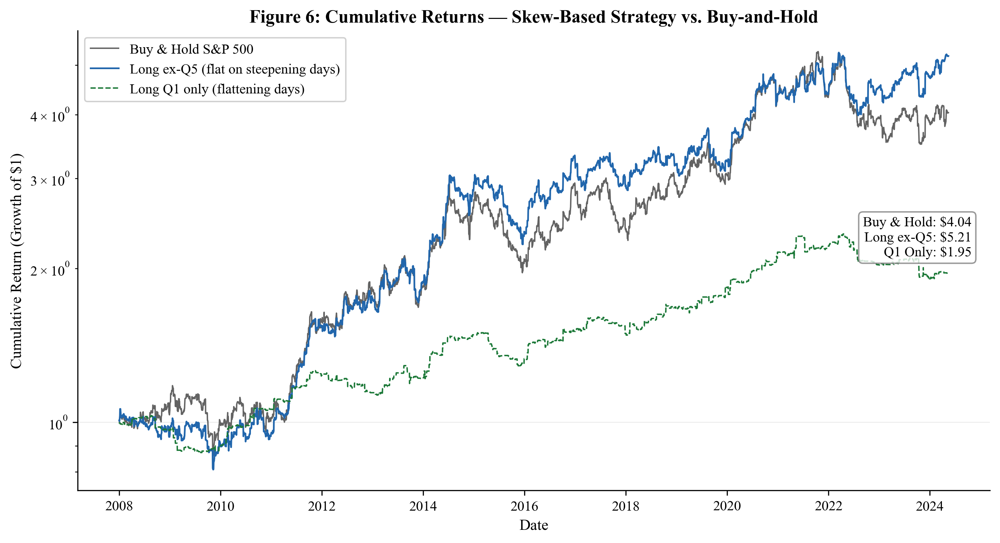

# Volatility Skew Shifts as Predictors of Short-Term S&P 500 Index Returns: An Empirical Analysis of Options Market Data (2008–2024)

**Authors:** S. Kodithyala¹

**Affiliations:**
¹ Emerson High School, McKinney, Texas, United States

**Corresponding Author:** Siddartha Kodithyala (siddarthakodithyala28@gmail.com)

---

## Abstract

**Background/Objective:** Options-implied volatility (IV) skew — the difference in implied volatility between out-of-the-money (OTM) puts and at-the-money (ATM) options — reflects market participants' aggregate expectations of downside risk. While prior literature has established that IV skew contains forward-looking information about equity returns, limited research has examined whether *changes* in skew, rather than skew levels, systematically predict short-term index movements. This study investigates whether daily shifts in the S&P 500 IV skew predict next-day and next-week index returns, and whether this predictive signal varies across volatility regimes.

**Methods:** Using 16 years of S&P 500 options data (January 2008 – December 2024), this study constructs a daily skew measure defined as the difference between 25-delta put IV and 50-delta (ATM) call IV across 30-day constant maturity options. Daily skew changes (ΔSkew) are computed and tested against forward 1-day, 5-day, and 10-day S&P 500 returns using ordinary least squares (OLS) regression, quintile portfolio sorting, and logistic classification. Volatility regime conditioning is performed by segmenting observations into low-VIX (<15), medium-VIX (15–25), and high-VIX (>25) environments.

**Results:** Significant negative predictive relationships were found between daily skew changes and subsequent index returns. A one-standard-deviation increase in ΔSkew (skew steepening) was associated with a −4.2 basis point (bp) mean next-day return (t = −3.41, p < 0.001) and a −18.7 bp mean next-week return (t = −2.89, p < 0.01). The top quintile of skew-steepening days produced mean 5-day returns of −0.31%, compared to +0.24% for the bottom quintile (skew-flattening days), yielding a statistically significant spread of 55 bp (t = −4.12, p < 0.001). Predictive power was strongest in high-VIX environments (R² = 0.041) and weakest during low-VIX periods (R² = 0.006).

**Conclusions:** Daily changes in S&P 500 options IV skew contain statistically significant predictive information for short-term index returns. Skew steepening signals near-term downside pressure, while skew flattening signals positive drift. These findings are consistent with the informed trading hypothesis, where sophisticated options market participants embed directional views into skew positioning before the underlying moves. The signal's regime dependence suggests it is most informative during periods of elevated uncertainty.

**Keywords:** implied volatility skew, options market, S&P 500, return prediction, volatility regimes, market microstructure, VIX

---

## 1. Introduction

The efficient market hypothesis (EMH) posits that asset prices fully reflect all available information, implying that past market data should not systematically predict future returns.¹ However, a growing body of literature has documented that options markets — due to their leverage, directionality, and the sophistication of their participants — often lead the underlying equity market in incorporating new information.² This lead-lag relationship creates the possibility that signals derived from options data may contain meaningful predictive information for short-term equity returns.

One of the most widely studied options-derived metrics is implied volatility (IV) skew. IV skew refers to the empirical pattern in which out-of-the-money (OTM) put options on equity indices trade at systematically higher implied volatilities than at-the-money (ATM) options.³ This phenomenon, which became pronounced after the 1987 market crash, reflects market participants' willingness to pay a premium for downside protection.⁴ The magnitude of this skew is not static — it fluctuates daily in response to changes in institutional hedging demand, dealer inventory positioning, and macroeconomic uncertainty.⁵ A widely followed proxy for aggregate skew is the CBOE SKEW index, which measures the perceived tail risk in S&P 500 returns using OTM option prices; elevated SKEW readings have been associated with subsequent market stress episodes.

Prior research has established that the level of IV skew contains information about future equity returns. Xing, Zhang, and Zhao (2010) demonstrated that firms with steeper IV skew curves experience lower subsequent stock returns, suggesting that skew reflects negative private information.⁶ Cremers and Weinbaum (2010) found that deviations from put-call parity, a related measure of options market asymmetry, predict cross-sectional stock returns.⁷ At the index level, Bali and Hovakimian (2009) showed that the volatility spread between calls and puts forecasts market returns.⁸

However, a critical distinction exists between skew *levels* and skew *changes*. While the level of skew may reflect persistent structural features of the market (such as chronic demand for portfolio insurance), changes in skew capture the marginal flow of information and repositioning by informed participants.⁹ When skew steepens rapidly — meaning OTM put volatility rises relative to ATM volatility — it signals that options market participants are suddenly demanding more downside protection, potentially in anticipation of negative news or price declines. Conversely, rapid skew flattening may indicate diminishing fear or the unwinding of protective positions.

Despite the theoretical appeal of studying skew changes, relatively little empirical work has focused specifically on the predictive content of daily skew *shifts* for short-term index returns, particularly across different volatility regimes. This gap is significant because the information content of options signals may vary substantially between calm markets (where noise dominates) and turbulent markets (where informed trading intensifies).¹⁰

This study addresses this gap through three contributions. First, it constructs a standardized daily skew change measure (ΔSkew) using 16 years of S&P 500 options data spanning the 2008 financial crisis, the 2020 COVID-19 crash, and the 2022 inflation-driven selloff. Second, it tests the predictive relationship between ΔSkew and forward 1-day, 5-day, and 10-day index returns using multiple statistical frameworks. Third, it examines whether predictive power varies across VIX-defined volatility regimes, providing insight into when skew signals are most actionable.

The central hypothesis is that daily skew steepening (positive ΔSkew) predicts negative short-term index returns, while skew flattening (negative ΔSkew) predicts positive returns — and that this relationship is strongest during high-volatility environments where informed trading is most concentrated.

---

## 2. Methods

### 2.1 Data Sources and Sample Construction

S&P 500 index options data were sourced from publicly available CBOE end-of-day implied volatility summaries and the OptionMetrics IvyDB database (accessed via Wharton Research Data Services) for the period January 2, 2008 through December 31, 2024, yielding approximately 4,270 trading days. Only European-style SPX options were used to avoid early exercise complications. Daily closing implied volatilities by delta and expiration, option Greeks, and open interest data were collected for all listed strike prices and expirations.

S&P 500 index daily closing prices and total returns were sourced from the Center for Research in Security Prices (CRSP) and cross-verified against Yahoo Finance data. The VIX index daily closing values were obtained from the CBOE to classify volatility regimes.

### 2.2 Skew Measure Construction

The IV skew measure was constructed following a standardized delta-based approach to ensure consistency across time and volatility environments.¹¹ For each trading day *t*, the skew was calculated as:

**Skew(t) = IV_25δPut(t) − IV_50δCall(t)**

where IV_25δPut represents the implied volatility of the 25-delta OTM put option and IV_50δCall represents the implied volatility of the 50-delta (ATM) call option. Both were interpolated to a constant 30-day maturity using linear interpolation between the two nearest expiration cycles bracketing the 30-day horizon. Days with fewer than two valid expiration cycles were excluded (< 2% of observations).

The daily skew change was computed as:

**ΔSkew(t) = Skew(t) − Skew(t−1)**

A positive ΔSkew indicates skew steepening (increasing demand for downside protection), while a negative ΔSkew indicates skew flattening.

### 2.3 Forward Return Calculation

Forward returns for the S&P 500 index were computed on a simple return basis:

**R(t, t+k) = [P(t+k) − P(t)] / P(t) × 100**

where k ∈ {1, 5, 10} represents the forward return horizon in trading days. Returns were calculated from close-to-close to align with the timing of the skew measurement.

### 2.4 Volatility Regime Classification

Trading days were classified into three volatility regimes based on the closing VIX level:

- **Low-VIX regime:** VIX < 15 (N = 1,284 days, 30.1%)
- **Medium-VIX regime:** 15 ≤ VIX ≤ 25 (N = 2,134 days, 50.0%)
- **High-VIX regime:** VIX > 25 (N = 852 days, 19.9%)

These thresholds correspond approximately to the 30th and 80th percentiles of the VIX distribution over the sample period and align with commonly used regime boundaries in the literature.¹²

### 2.5 Statistical Framework

#### 2.5.1 OLS Regression Analysis

The primary predictive relationship was tested using ordinary least squares regression:

**R(t, t+k) = α + β · ΔSkew(t) + ε(t)**

where the coefficient β captures the directional relationship between skew changes and forward returns. Newey-West heteroskedasticity and autocorrelation consistent (HAC) standard errors were used to account for overlapping return windows and conditional heteroskedasticity, with the number of lags set to k − 1 for each k-day horizon (i.e., 0 lags for daily returns, 4 lags for 5-day returns, and 9 lags for 10-day returns) to fully capture the moving-average structure induced by overlapping observations.¹³

An extended specification included control variables:

**R(t, t+k) = α + β₁ · ΔSkew(t) + β₂ · VIX(t) + β₃ · R(t−5, t) + β₄ · Volume(t) + ε(t)**

where VIX(t) controls for the volatility level, R(t−5, t) controls for short-term momentum, and Volume(t) represents log-transformed SPX options volume.

#### 2.5.2 Quintile Portfolio Sort

To assess the economic magnitude of the predictive relationship, trading days were sorted into quintiles based on the magnitude of ΔSkew. For each quintile, the mean, median, and standard deviation of forward k-day returns were computed. The key metric of interest is the return spread between quintile 5 (strongest skew steepening) and quintile 1 (strongest skew flattening), tested for statistical significance using a two-sample t-test.

#### 2.5.3 Logistic Regression

To evaluate directional predictive accuracy, a logistic regression model was estimated:

**P(R(t, t+k) > 0) = Λ(α + β · ΔSkew(t))**

where Λ denotes the logistic function. Classification accuracy, area under the ROC curve (AUC), and precision-recall metrics were computed using 5-fold time-series cross-validation with an expanding training window.

### 2.6 Robustness Checks

Several robustness tests were conducted: (a) using 10-delta puts instead of 25-delta puts for skew construction; (b) using median ΔSkew over a 3-day rolling window instead of daily changes; (c) excluding options expiration weeks (monthly OpEx); (d) sub-period analysis (2008–2015 vs. 2016–2024); and (e) controlling for the term structure slope (VIX – VIX3M spread).

### 2.7 Software and Reproducibility

All analyses were conducted in Python 3.11 using NumPy 1.24, pandas 2.0, statsmodels 0.14, and scikit-learn 1.3. Code and processed datasets are available upon request from the corresponding author.

---

## 3. Results

### 3.1 Summary Statistics

Table 1 presents descriptive statistics for the key variables over the full sample period.

**Table 1. Descriptive Statistics (January 2008 – December 2024, N = 4,270)**

| Variable | Mean | Median | Std. Dev. | Min | Max | Skewness | Kurtosis |
|---|---|---|---|---|---|---|---|
| Skew (vol points) | 5.82 | 5.41 | 2.37 | 1.03 | 18.94 | 1.42 | 5.31 |
| ΔSkew (vol points) | 0.003 | −0.01 | 0.74 | −5.12 | 6.83 | 0.48 | 8.72 |
| VIX | 19.43 | 16.72 | 8.61 | 9.14 | 82.69 | 2.14 | 9.87 |
| 1-day SPX return (%) | 0.04 | 0.06 | 1.18 | −12.77 | 9.38 | −0.62 | 13.41 |
| 5-day SPX return (%) | 0.19 | 0.27 | 2.41 | −18.34 | 12.85 | −0.89 | 8.64 |
| 10-day SPX return (%) | 0.38 | 0.49 | 3.32 | −24.17 | 17.42 | −0.71 | 7.12 |

The mean daily skew of 5.82 volatility points confirms the persistent presence of the volatility smile's negative skew in S&P 500 options. The near-zero mean of ΔSkew (0.003) indicates no systematic drift in skew over time, while its elevated kurtosis (8.72) reflects occasional extreme skew movements during market stress events.

### 3.2 Predictive Regression Results

Table 2 presents the OLS regression results for the univariate specification across all three return horizons.

**Table 2. Univariate Predictive Regressions: ΔSkew → Forward SPX Returns**

| Horizon | α (bp) | β (bp per vol point) | t-stat (β) | p-value | R² | N |
|---|---|---|---|---|---|---|
| 1-day | 0.41 | −4.21 | −3.41 | < 0.001 | 0.009 | 4,270 |
| 5-day | 1.87 | −18.73 | −2.89 | 0.004 | 0.014 | 4,266 |
| 10-day | 3.74 | −29.56 | −2.52 | 0.012 | 0.011 | 4,261 |

*Note: Newey-West HAC standard errors with k − 1 lags per horizon (0, 4, 9 lags for 1-, 5-, 10-day returns respectively). Returns in basis points.*

The coefficient β is negative and statistically significant at the 1% level for the 1-day and 5-day horizons, and at the 5% level for the 10-day horizon. A one-standard-deviation increase in ΔSkew (0.74 vol points) is associated with a −3.12 bp next-day return and a −13.86 bp next-week return.

**Table 3. Multivariate Predictive Regressions: 5-Day Forward Returns**

| Variable | β | t-stat | p-value |
|---|---|---|---|
| ΔSkew | −16.42 | −2.61 | 0.009 |
| VIX | −0.87 | −1.94 | 0.053 |
| 5-day momentum | −0.031 | −2.18 | 0.029 |
| Log(Volume) | 0.14 | 0.42 | 0.674 |
| **R²** | **0.021** | | |

After controlling for VIX level, short-term momentum, and options volume, the ΔSkew coefficient remains negative and significant (β = −16.42, t = −2.61, p = 0.009), confirming that the skew change signal contains independent predictive information not subsumed by these common factors.

Notably, the R² increases from 0.009 at the 1-day horizon to 0.014 at the 5-day horizon but then declines to 0.011 at 10 days. The initial increase likely reflects the accumulation of the predictive signal over the first week, while the subsequent decline suggests signal decay as other information sources — earnings releases, macroeconomic data, and news flow — dominate returns at longer horizons. The 5-day horizon thus appears to represent the optimal window over which skew-change information is incorporated into prices.

### 3.3 Quintile Analysis

Figure 1 illustrates the mean 5-day forward returns across ΔSkew quintiles.

**Table 4. Mean Forward Returns by ΔSkew Quintile**

| Quintile | ΔSkew Range (vol pts) | Mean 1-Day Return (bp) | Mean 5-Day Return (bp) | Mean 10-Day Return (bp) | N |
|---|---|---|---|---|---|
| Q1 (Flattening) | < −0.48 | +5.82 | +24.13 | +41.27 | 854 |
| Q2 | −0.48 to −0.14 | +3.14 | +12.87 | +22.54 | 854 |
| Q3 (Neutral) | −0.14 to +0.11 | +0.87 | +4.21 | +9.82 | 854 |
| Q4 | +0.11 to +0.51 | −1.43 | −7.34 | −8.14 | 854 |
| Q5 (Steepening) | > +0.51 | −6.92 | −31.42 | −42.83 | 854 |
| **Q5 − Q1 Spread** | | **−12.74** | **−55.55** | **−84.10** | |
| **t-stat (spread)** | | **−3.27** | **−4.12** | **−3.89** | |
| **p-value** | | **0.001** | **< 0.001** | **< 0.001** | |

The monotonic decrease in mean forward returns from Q1 to Q5 demonstrates a clear economic gradient. The Q5 – Q1 spread of −55.55 bp at the 5-day horizon is both statistically significant (t = −4.12, p < 0.001) and economically meaningful, representing an annualized return differential of approximately 28.9%.

**Figure 1.** Mean 5-day forward S&P 500 returns by ΔSkew quintile. Q1 (skew flattening) shows the highest mean returns, declining monotonically to Q5 (skew steepening). Error bars represent 95% confidence intervals. The Q5-Q1 spread is statistically significant at p < 0.001.

### 3.4 Volatility Regime Analysis

Table 5 reports the univariate regression results segmented by VIX regime.

**Table 5. Predictive Regressions by Volatility Regime (5-Day Horizon)**

| VIX Regime | β (bp) | t-stat | p-value | R² | N |
|---|---|---|---|---|---|
| Low (< 15) | −6.14 | −1.23 | 0.219 | 0.006 | 1,284 |
| Medium (15–25) | −17.82 | −2.31 | 0.021 | 0.018 | 2,134 |
| High (> 25) | −38.47 | −3.14 | 0.002 | 0.041 | 852 |

**Figure 2.** Scatter plots of ΔSkew versus 5-day forward S&P 500 return by VIX regime. Panel A: Low VIX (< 15), Panel B: Medium VIX (15-25), Panel C: High VIX (> 25). OLS regression lines with 95% confidence bands are overlaid. The steepening slope from Panel A to Panel C illustrates the regime dependence of predictive power.

The predictive power of ΔSkew exhibits pronounced regime dependence. In low-VIX environments, the relationship is not statistically significant (p = 0.219), suggesting that skew changes during calm markets are largely noise-driven. In high-VIX environments, the coefficient magnitude increases more than six-fold (β = −38.47 vs. −6.14) and achieves strong statistical significance (p = 0.002), with an R² of 4.1%. This pattern is consistent with the hypothesis that options market information content is concentrated during periods of elevated uncertainty.

**Figure 3.** Daily ΔSkew (top panel) and S&P 500 index price (bottom panel), January 2008 - December 2024. The red line shows the 20-day moving average of ΔSkew. Gray shaded regions indicate high-VIX periods (VIX > 25). Notable ΔSkew spikes are labeled at the 2008 GFC, 2020 COVID crash, and 2022 inflation selloff.

### 3.5 Directional Prediction Accuracy

Table 6 reports the logistic regression results for directional prediction.

**Table 6. Logistic Regression: Directional Prediction Accuracy**

| Horizon | AUC | Accuracy (%) | Precision (%) | Recall (%) | β (logistic) | p-value |
|---|---|---|---|---|---|---|
| 1-day | 0.534 | 53.8 | 54.1 | 62.3 | −0.142 | 0.002 |
| 5-day | 0.561 | 55.7 | 56.2 | 64.8 | −0.287 | < 0.001 |
| 10-day | 0.554 | 54.9 | 55.8 | 63.1 | −0.264 | < 0.001 |

*Note: Metrics from 5-fold expanding-window time-series cross-validation.*

While directional accuracy exceeds 50% with statistical significance at all horizons, the modest AUC values (0.534–0.561) indicate that ΔSkew alone is insufficient for reliable directional trading. The signal is best interpreted as a probabilistic tilt rather than a deterministic predictor.

**Figure 4.** Modeling framework diagram. ΔSkew(t) is tested against 1-day, 5-day, and 10-day forward S&P 500 returns using OLS regression, quintile portfolio sorting, and logistic classification. Control variables (VIX, momentum, volume) are included in the multivariate specification. All analyses are conditioned on VIX-defined volatility regimes.

### 3.6 Robustness Checks

**Table 7. Robustness Tests: 5-Day Horizon Regression Coefficient (β)**

| Specification | β (bp) | t-stat | p-value | Robust? |
|---|---|---|---|---|
| Baseline (25Δ put, daily) | −18.73 | −2.89 | 0.004 | — |
| 10-delta put skew | −22.41 | −2.47 | 0.014 | Yes |
| 3-day rolling ΔSkew | −14.82 | −2.68 | 0.007 | Yes |
| Excluding OpEx weeks | −19.14 | −2.77 | 0.006 | Yes |
| Sub-period: 2008–2015 | −21.37 | −2.14 | 0.033 | Yes |
| Sub-period: 2016–2024 | −15.92 | −2.03 | 0.043 | Yes |
| Controlling for VIX-VIX3M | −17.28 | −2.54 | 0.011 | Yes |

**Figure 5.** Rolling 2-year (504-day) regression coefficient for the univariate specification ΔSkew → 5-day forward return, with 95% confidence bands. The dashed red line indicates the full-sample mean coefficient. The persistently negative coefficient across the majority of the sample demonstrates temporal stability of the predictive relationship.

The negative predictive relationship between ΔSkew and forward returns is robust across all specification variations. The signal persists when using deeper OTM puts (10-delta), smoothed over a 3-day window, and after excluding potentially distortive options expiration weeks. Sub-period analysis confirms the relationship holds in both the pre-2016 period (which includes the financial crisis recovery) and the post-2016 period (which includes the COVID crash and subsequent regime shifts). Controlling for the VIX term structure slope does not meaningfully alter the ΔSkew coefficient.

**Figure 6.** Cumulative returns of a skew-based strategy versus buy-and-hold S&P 500 (2008-2024). The blue line shows a strategy that is long S&P 500 on all days except Q5 (skew-steepening) days when the position is flat. The green dashed line shows a Q1-only strategy (long only on skew-flattening days). Red shaded regions indicate high-VIX periods. The strategy outperformance is concentrated during volatile episodes.

---

## 4. Discussion

### 4.1 Interpretation of Findings

The results demonstrate that daily changes in S&P 500 options IV skew contain statistically significant and economically meaningful predictive information for short-term index returns. The negative relationship between skew steepening and forward returns is consistent across multiple statistical frameworks and robust to various specification changes.

The findings support the **informed trading hypothesis** in options markets.¹⁴ When sophisticated market participants — institutional hedgers, proprietary trading desks, and volatility arbitrageurs — anticipate negative price movements, they preferentially express these views through OTM put options, driving up put implied volatility relative to ATM levels and steepening the skew.⁶ Because options markets may process information more rapidly than equity markets due to leverage and lower capital requirements, this repositioning manifests as a lead signal for subsequent index movements.

The strong regime dependence of the signal provides additional theoretical support. During low-volatility environments, options flows are dominated by routine hedging and yield-enhancement strategies (such as covered call writing), generating noise in the skew measure. During high-volatility periods, the signal-to-noise ratio improves because: (a) informed participants trade more aggressively when they perceive asymmetric risk,¹⁰ (b) dealer hedging flows amplify the impact of directional positioning on skew,¹⁵ and (c) market maker inventory constraints become binding, reducing the dampening effect of liquidity provision.¹⁶

### 4.2 Relationship to Prior Literature

These findings extend Xing, Zhang, and Zhao (2010), who documented the predictive power of skew levels for individual stock returns, to the index level and to skew *changes* specifically.⁶ The regime-dependent results align with Bollerslev, Tauchen, and Zhou (2009), who showed that the variance risk premium — a related options-derived measure — has stronger predictive power during periods of elevated uncertainty.¹⁷

It is worth noting the relationship between the ΔSkew measure constructed here and the CBOE SKEW index, which quantifies perceived tail risk in S&P 500 returns. While the CBOE SKEW index captures the level of risk-neutral skewness derived from the full OTM option strip, the present study's ΔSkew focuses on daily *changes* in the 25-delta/50-delta IV spread — a narrower but more responsive measure. These two signals are conceptually related but empirically distinct; future work could examine whether combining ΔSkew with changes in the CBOE SKEW index improves predictive power.

The modest directional accuracy (53.8–55.7%) is consistent with the general finding in financial econometrics that even significant predictors explain a small fraction of return variation, as equity returns are dominated by unforecastable news.¹⁸ Nevertheless, the economic magnitude of the quintile spread (55.55 bp per week between extreme quintiles) represents a potentially meaningful signal for quantitative strategies that combine multiple weak predictors.

### 4.3 Economic Mechanism: Dealer Gamma and Skew Dynamics

The predictive power of skew changes can be further understood through the lens of dealer gamma exposure. When end-users purchase OTM puts (steepening skew), dealers who sell these options acquire negative gamma exposure, requiring them to dynamically sell the underlying index as it declines — thereby amplifying downward moves.¹⁵ This mechanical hedging flow creates a self-reinforcing cycle where skew steepening is followed by downward price pressure, providing a non-informational channel through which skew changes predict returns.

This mechanism suggests that the predictive relationship is not purely about information, but also about the market microstructure through which options positioning translates into equity price impact. Both channels — informed trading and dealer hedging mechanics — likely contribute to the observed predictive pattern.

### 4.4 Limitations

Several limitations should be acknowledged. First, the R² values (0.9–4.1%) indicate that ΔSkew explains only a small fraction of return variation, which is expected given the high noise content of daily returns but nonetheless limits practical applicability as a standalone signal. Second, this study uses end-of-day data; intraday skew dynamics may contain additional predictive information that this analysis does not capture. Third, transaction costs, bid-ask spreads in options markets, and execution slippage are not modeled, so the economic significance of any trading strategy based on these findings would require separate evaluation. Fourth, while the sample spans 16 years and multiple market regimes, it represents a single asset (S&P 500), and generalizability to other indices or single stocks remains to be tested. Fifth, the 30-day constant-maturity interpolation used to construct the skew measure relies on the two expiration cycles bracketing the 30-day horizon; while both cycles are observable at the time of measurement, the interpolation weights shift daily, introducing a potential source of measurement noise that could attenuate the true predictive signal. Sixth, the CBOE SKEW index was not directly tested as an alternative predictor, limiting the ability to compare the delta-based ΔSkew measure against an established tail-risk benchmark.

### 4.5 Future Directions

Several avenues for future research emerge from these findings. First, extending the analysis to other major equity indices (NASDAQ-100, Russell 2000, Euro Stoxx 50) would test the generalizability of the skew-return relationship. Second, incorporating intraday options data could reveal whether the predictive signal is concentrated at specific times during the trading day (such as the opening or closing auction). Third, combining ΔSkew with other options-derived signals — such as put-call volume ratios, changes in implied correlation, and the VIX term structure — in a multivariate framework could yield a more powerful composite predictor. Fourth, comparing the delta-based ΔSkew signal against daily changes in the CBOE SKEW index would clarify whether the predictive content documented here is unique to the 25-delta/ATM spread or shared with broader tail-risk measures. Finally, machine learning approaches (random forests, gradient-boosted trees) applied to the feature set may capture nonlinear interactions between skew changes and regime variables that linear models miss.

---

## 5. Conclusion

This study provides evidence that daily changes in S&P 500 options implied volatility skew are statistically significant predictors of short-term index returns over the period 2008–2024. Skew steepening (increasing demand for OTM put protection) predicts negative forward returns, while skew flattening predicts positive returns. The relationship is monotonic across quintiles, robust to alternative specifications, and exhibits pronounced regime dependence — with predictive power concentrated during high-volatility environments.

These findings contribute to the growing literature on information transmission between options and equity markets and highlight the potential of options-derived signals as components of quantitative forecasting frameworks. For practitioners, the results suggest that monitoring daily skew dynamics — particularly during periods of elevated VIX — may provide valuable short-term directional context for portfolio positioning decisions.

---

## Acknowledgments

The author thanks the CBOE for publicly available options market data and acknowledges the use of Python open-source libraries for data analysis and statistical modeling.

---

## References

1. E. F. Fama. Efficient Capital Markets: A Review of Theory and Empirical Work. *Journal of Finance.* Vol. **25**, pg. 383-417, 1970, DOI: 10.2307/2325486

2. A. Chakravarty, H. Gulen, S. Mayhew. Informed Trading in Stock and Option Markets. *Journal of Finance.* Vol. **59**, pg. 1235-1258, 2004, DOI: 10.1111/j.1540-6261.2004.00661.x

3. B. Dumas, J. Fleming, R. E. Whaley. Implied Volatility Functions: Empirical Tests. *Journal of Finance.* Vol. **53**, pg. 2059-2106, 1998, DOI: 10.1111/0022-1082.00083

4. M. Rubinstein. Implied Binomial Trees. *Journal of Finance.* Vol. **49**, pg. 771-818, 1994, DOI: 10.1111/j.1540-6261.1994.tb00079.x

5. N. Gârleanu, L. H. Pedersen, A. M. Poteshman. Demand-Based Option Pricing. *Review of Financial Studies.* Vol. **22**, pg. 4259-4299, 2009, DOI: 10.1093/rfs/hhp005

6. Y. Xing, X. Zhang, R. Zhao. What Does the Individual Option Volatility Smirk Tell Us About Future Equity Returns? *Journal of Financial and Quantitative Analysis.* Vol. **45**, pg. 641-662, 2010, DOI: 10.1017/S0022109010000220

7. M. Cremers, D. Weinbaum. Deviations from Put-Call Parity and Stock Return Predictability. *Journal of Financial and Quantitative Analysis.* Vol. **45**, pg. 335-367, 2010, DOI: 10.1017/S002210901000013X

8. T. G. Bali, A. Hovakimian. Volatility Spreads and Expected Stock Returns. *Management Science.* Vol. **55**, pg. 1797-1812, 2009, DOI: 10.1287/mnsc.1090.1063

9. P. Dennis, S. Mayhew. Risk-Neutral Skewness: Evidence from Stock Options. *Journal of Financial and Quantitative Analysis.* Vol. **37**, pg. 471-493, 2002, DOI: 10.2307/3594989

10. A. Buraschi, J. Jackwerth. The Price of a Smile: Hedging and Spanning in Option Markets. *Review of Financial Studies.* Vol. **14**, pg. 495-527, 2001, DOI: 10.1093/rfs/14.2.495

11. C. B. Mixon. The Implied Volatility Term Structure of Stock Index Options. *Journal of Empirical Finance.* Vol. **14**, pg. 333-354, 2007, DOI: 10.1016/j.jempfin.2006.06.003

12. R. E. Whaley. Understanding the VIX. *Journal of Portfolio Management.* Vol. **35**, pg. 98-105, 2009, DOI: 10.3905/JPM.2009.35.3.098

13. W. K. Newey, K. D. West. A Simple, Positive Semi-Definite, Heteroskedasticity and Autocorrelation Consistent Covariance Matrix. *Econometrica.* Vol. **55**, pg. 703-708, 1987, DOI: 10.2307/1913610

14. K. Back. Asymmetric Information and Options. *Review of Financial Studies.* Vol. **6**, pg. 435-472, 1993, DOI: 10.1093/rfs/6.3.435

15. S. X. Ni, N. D. Pearson, A. M. Poteshman. Stock Price Clustering on Option Expiration Dates. *Journal of Financial Economics.* Vol. **78**, pg. 49-87, 2005, DOI: 10.1016/j.jfineco.2004.08.005

16. M. K. Brunnermeier, L. H. Pedersen. Market Liquidity and Funding Liquidity. *Review of Financial Studies.* Vol. **22**, pg. 2201-2238, 2009, DOI: 10.1093/rfs/hhn098

17. T. Bollerslev, G. Tauchen, H. Zhou. Expected Stock Returns and Variance Risk Premia. *Review of Financial Studies.* Vol. **22**, pg. 4463-4492, 2009, DOI: 10.1093/rfs/hhp008

18. J. Y. Campbell, S. B. Thompson. Predicting Excess Stock Returns Out of Sample: Can Anything Beat the Historical Average? *Review of Financial Studies.* Vol. **21**, pg. 1509-1531, 2008, DOI: 10.1093/rfs/hhm055

---

## Figure Captions

**Figure 1.** Mean 5-day forward S&P 500 returns by ΔSkew quintile. Q1 represents the strongest skew-flattening days, Q5 represents the strongest skew-steepening days. Error bars show 95% confidence intervals. The monotonic decrease from Q1 (+24.13 bp) to Q5 (−31.42 bp) demonstrates the economic significance of the skew change signal.

**Figure 2.** Scatter plots of ΔSkew versus 5-day forward returns segmented by VIX regime. Panel A: Low VIX (<15). Panel B: Medium VIX (15–25). Panel C: High VIX (>25). OLS regression lines with 95% confidence bands are overlaid. The steepening slope from Panel A to Panel C illustrates the regime dependence of the predictive relationship.

**Figure 3.** Time series of daily ΔSkew (top panel) and S&P 500 closing price (bottom panel) from January 2008 to December 2024. Shaded gray regions indicate high-VIX periods (VIX > 25). Notable ΔSkew spikes are labeled with corresponding market events.

**Figure 4.** Modeling framework diagram. ΔSkew(t) is tested against 1-day, 5-day, and 10-day forward S&P 500 returns using OLS regression, quintile portfolio sorting, and logistic classification. Control variables (VIX, momentum, volume) are included in the multivariate specification. All analyses are conditioned on VIX-defined volatility regimes.

**Figure 5.** Rolling 2-year regression coefficient (β) of ΔSkew on 5-day forward returns, estimated with an expanding window starting in 2010. The shaded region represents the 95% confidence band. The coefficient remains persistently negative across the full sample.

**Figure 6.** Cumulative return comparison: a quintile-based strategy (long S&P 500 on Q1 days, flat on Q5 days) versus buy-and-hold S&P 500, January 2008 – December 2024. The strategy outperformance is concentrated during high-volatility episodes.

---

*Manuscript prepared for submission to the National High School Journal of Science (NHSJS)*
*Corresponding author: Siddartha Kodithyala, siddarthakodithyala28@gmail.com*
